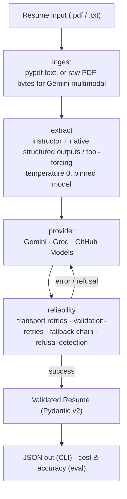

# resume-extractor

A typed, multi-provider LLM client + CLI that turns **messy real-world resumes/CVs
(PDF or text) into clean, schema-validated structured data** — name, contact,
skills, work history with dates, and education — through **one interface over three
free-tier providers**, with automatic retries and provider fallback.

It runs entirely on **free API tiers at $0**. Cost is reported as a *hypothetical*
analysis at each provider's published list price ("ran it free, here's the bill at
scale").

> **Phase 2 portfolio project.** Depth and measurement over breadth — a reusable
> library, a small CLI, and a real benchmark (accuracy + cost + latency).

---

## What it does

- Reads a resume **PDF** (multimodal, sent directly to Gemini) **or text** and
  returns a validated `Resume` (Pydantic v2).
- Talks to **Gemini (primary)**, **Groq (Llama 3.3 70B)**, and **GitHub Models
  (GPT-4o-mini)** behind a single `extract_resume(text, provider=...)` signature.
- Prefers **native structured outputs**, falling back to tool-forcing per provider.
- Adds production reliability: transport retries (429/5xx), `instructor`
  validation-retries, and a **provider fallback chain** with refusal detection.
- Ships a **benchmark** (`BENCHMARK.md`) and a reproducible **eval harness**
  (`eval/`).

## Provider stack (free tiers only — no Anthropic, no paid OpenAI)

| Role | Pinned model | Structured-output mode | PDF |
|---|---|---|---|
| **Primary** | `gemini-2.5-flash` | native `response_schema` | multimodal (direct) |
| **Fallback** | `llama-3.3-70b-versatile` (Groq) | `Mode.JSON` | text-only (pypdf) |
| **Third** | `openai/gpt-4o-mini` (GitHub Models) | `Mode.TOOLS` | text-only (pypdf) |

Keys live in `.env.example`: `GEMINI_API_KEY`, `GROQ_API_KEY`, `GITHUB_MODELS_TOKEN`.
There is intentionally **no `ANTHROPIC_API_KEY`**.

---

## Architecture / data flow



---

## Project structure

```
resume-extractor/
├── src/resume_extractor/
│   ├── __init__.py        # public exports
│   ├── __main__.py        # `python -m resume_extractor`
│   ├── schema.py          # Pydantic models: Resume / Job / Education (the "form")
│   ├── config.py          # pinned model IDs, endpoints, temperature, env-var map
│   ├── providers.py       # ProviderSpec registry + cached client factory (one interface)
│   ├── ingest.py          # PDF -> text (pypdf) for text-only providers
│   ├── extract.py         # the extraction calls (text + multimodal) + retries
│   ├── reliability.py     # provider fallback chain + refusal detection
│   ├── caching.py         # prompt/context-caching analysis + helper
│   ├── costs.py           # token usage + hypothetical cost
│   ├── scoring.py         # field-level accuracy scoring (eval)
│   ├── sanity.py          # one-line Gemini connectivity check
│   └── cli.py             # command-line entry point
├── tests/
│   ├── data/sample_resume.txt
│   ├── sample_resumes/    # PDF fixtures + CREDITS.md (public templates / synthetic)
│   ├── live_utils.py      # skip-on-free-tier-limit helper
│   └── test_*.py          # schema, scoring, costs, reliability (offline) + live tests
├── eval/
│   ├── run_eval.py        # quota-aware accuracy harness (cached predictions)
│   ├── latency.py         # wall-clock latency harness
│   ├── text_resumes/      # synthetic resumes (committed)
│   ├── gold/              # exact gold labels for the synthetic set
│   ├── gold_pdf/          # human-verified gold for the PDF samples
│   ├── REPORT.md          # generated accuracy report
│   └── latency.json       # generated latency numbers
├── BENCHMARK.md           # accuracy + cost + latency results
├── BUILD-LOG.md           # decisions / deviations / what broke
├── CLAUDE.md              # project context & engineering rules
├── README.md
├── pyproject.toml
└── .env.example
```

---

## Module guide (`src/resume_extractor/`)

- **`schema.py`** — the extraction "form". Pydantic v2 models `Resume`, `Job`,
  `Education`; every field optional-with-default so a missing field returns
  null/empty rather than crashing or hallucinating. Deliberately **no
  `extra="forbid"`** (it emits `additionalProperties`, which Gemini's native
  `response_schema` rejects). Used everywhere as the `response_model` /
  `response_schema`.
- **`config.py`** — single source of truth for pinned model IDs (`GEMINI_MODEL`,
  `GROQ_MODEL`, `GITHUB_MODEL`), endpoints (`GROQ_ENDPOINT`,
  `GITHUB_MODELS_ENDPOINT`), `TEMPERATURE = 0`, and the provider→env-var map.
- **`providers.py`** — the "one interface". A `ProviderSpec` registry (model, key,
  base URL, instructor mode, multimodal flag) plus cached factories
  `text_client(provider)` (instructor over google-genai or an OpenAI-compatible
  client) and `gemini_raw_client()` (raw google-genai for the multimodal path).
- **`ingest.py`** — `pdf_to_text(path)`: extract text from a PDF with `pypdf` (the
  path text-only providers use). Raises on image-only PDFs (→ use Gemini multimodal).
- **`extract.py`** — the extraction calls, all `temperature=0`, pinned model, with a
  `tenacity` transport retry (429/5xx/timeouts) and `instructor` validation-retries:
  - `extract_resume(text, provider="gemini")` — text, any provider (one signature).
  - `extract_resume_from_pdf(path)` — **Gemini multimodal**, native `response_schema`.
  - `extract_resume_from_pdf_text(path, provider)` — pypdf text → text path.
  - `extract_resume_with_usage(text, provider)` — also returns the raw response for
    cost accounting. Holds the `SYSTEM_PROMPT` (the "don't hallucinate" instruction).
- **`reliability.py`** — `extract_with_fallback(source, providers=..., is_pdf=...)`:
  walks the chain Gemini→Groq→GitHub, returning a `FallbackResult` (`provider`,
  `fallback_count`, `refusals`, per-`Attempt` records). `is_refusal()` classifies
  safety/content-block errors (never stored as data); `AllProvidersFailed` if none
  succeed.
- **`caching.py`** — caching analysis (why prompt caching is ~0% for short, unique
  resumes — see BENCHMARK §2) + `cache_read_fraction(usage)` to quantify cache reuse
  from a `Usage` reading.
- **`costs.py`** — `PRICES` (per-1M list prices, dated), normalized `Usage`,
  `usage_from_completion(provider, completion)` (reads Gemini `usage_metadata` and
  OpenAI-compatible `usage`), `cost_usd` / `cost_per_1000`.
- **`scoring.py`** — field-level accuracy: normalized scalar match (name/email/phone/
  location), set-F1 for skills / companies / institutions, `score()` + `aggregate()`.
- **`sanity.py`** — `hello_gemini()`: one-line Gemini connectivity/credentials check.
- **`cli.py`** — `main()`: the `resume-extractor` command (argparse). Parses
  `file`, `--provider`, `--fallback`, `--cost`; routes PDFs to multimodal (Gemini) or
  the text path (Groq/GitHub); prints validated JSON (UTF-8) with clean errors.

---

## How to run

```bash
# 1. Install (uv creates an isolated venv from pyproject + uv.lock)
uv sync

# 2. Secrets
cp .env.example .env        # then paste your free keys into .env

# 3. Sanity check (one live Gemini call)
uv run python -m resume_extractor.sanity

# 4. Extract a resume
uv run resume-extractor path/to/resume.pdf --provider gemini      # multimodal PDF
uv run resume-extractor path/to/resume.pdf --provider groq        # pypdf text -> Groq
uv run resume-extractor path/to/resume.txt --provider github --cost
uv run resume-extractor path/to/resume.pdf --fallback             # Gemini->Groq->GitHub

# 5. Tests & lint
uv run pytest                # live tests auto-skip without keys / on free-tier limits
uv run ruff check . && uv run ruff format --check .

# 6. Reproduce the benchmark
uv run python eval/run_eval.py            # Groq + GitHub accuracy (cached; no Gemini)
uv run python eval/run_eval.py --gemini   # + Gemini multimodal comparison
uv run python eval/latency.py --gemini    # latency (Gemini row needs fresh quota)
```

Get free keys: Gemini → [aistudio.google.com/apikey](https://aistudio.google.com/apikey) ·
Groq → [console.groq.com](https://console.groq.com) ·
GitHub Models → a GitHub PAT with **Models: read**.

---

## Benchmark (summary)

Full detail and methodology in [`BENCHMARK.md`](BENCHMARK.md). Spend is **$0**; cost
is hypothetical at list price (verified 2026-06-18).

| Provider (path) | Text acc (exact gold) | PDF acc (verified gold) | Hyp. cost / 1k | Latency median |
|---|---|---|---|---|
| Gemini (multimodal PDF) | — | 80.4% (n=4) | $0.60 | _pending fresh quota_ |
| Groq (text) | **100%** (n=4) | **85.4%** (n=4) | $1.94 | **0.67s** |
| GitHub Models (text) | **100%** (n=4) | 100%\* (n=3) | **$0.155** | 3.93s |

\* GitHub seeded the PDF gold (then human-verified), so it scores at ceiling **by
construction** — the meaningful comparison is **Groq-text (85.4%) vs
Gemini-multimodal (80.4%)**. Gemini wins **companies** (multi-column layout), Groq
wins **skills** (icon-bar resume defeats multimodal). GitHub Models can't process the
largest PDF (small free-tier input cap) → n=3.

---

## Production decision log

- **Free-tier-only, $0.** The author has Claude Max but no paid API billing (Max ≠
  API). The project is provider-agnostic by design, so building entirely on free
  tiers changes *which* providers we call, not *what* we build. No Anthropic key
  exists or is permitted (it would also bill the coding agent).
- **Native structured outputs > tool-forcing > prompt-JSON.** Gemini uses native
  `response_schema` (schema enforced by the API, not billed as prompt → leanest input
  at 176 tok). GitHub Models uses `Mode.TOOLS`. **Groq moved `Mode.TOOLS` →
  `Mode.JSON`** after tool-calling intermittently hard-400'd ("failed to call a
  function"); JSON mode is reliable but injects the schema as prompt text → ~3× the
  input tokens (2615 vs 788; $1.94 vs $0.61 / 1k). We accept the cost for reliability
  — and the fallback chain would catch a tool-calling failure anyway.
- **Gemini ~20-requests/day quota discipline.** Gemini is treated as scarce and
  reserved for the multimodal-PDF path. The eval **caches every prediction to disk**
  so reruns cost zero Gemini; live tests **skip (not fail)** on quota/transient
  errors; Groq (~1k/day) and GitHub (~50/day) are the workhorses.
- **PDF ingestion is provider-shaped.** Gemini reads PDFs directly (best on messy /
  multi-column / icon-font layouts, where `pypdf` mangles spacing and leaks icon
  glyphs); text-only providers get `pypdf`-extracted text. Both miss skills rendered
  as graphics (proficiency bars).
- **Prompt caching ≈ 0% for this workload.** Resumes are short and unique; the only
  shared prefix (the system prompt) is below Gemini's implicit-cache minimum. The
  pipeline still reads cached-token counts, so a cache-friendly workload would show
  the saving automatically.
- **Eval gold provenance (honest caveat).** PDF gold was seeded by a `github_text`
  extraction, then human-verified line-by-line. So `github_text` scores near-ceiling
  by construction, and the gold carries mild text-path bias; the unbiased read is
  Groq-text vs Gemini-multimodal. Truly independent gold is future work.
- **Known limitation.** The transport retry treats a *daily*-quota 429 like a
  transient one, so it burns its full backoff (~60s) before giving up on a
  quota-exhausted Gemini call. A future tweak could parse the quota metric /
  `RetryInfo` to fail fast on daily caps.
- **Secrets hygiene.** Keys live in git-ignored `.env`; only `.env.example` is
  committed. Sample resumes are public templates / open-source examples / synthetic —
  see [`tests/sample_resumes/CREDITS.md`](tests/sample_resumes/CREDITS.md).
